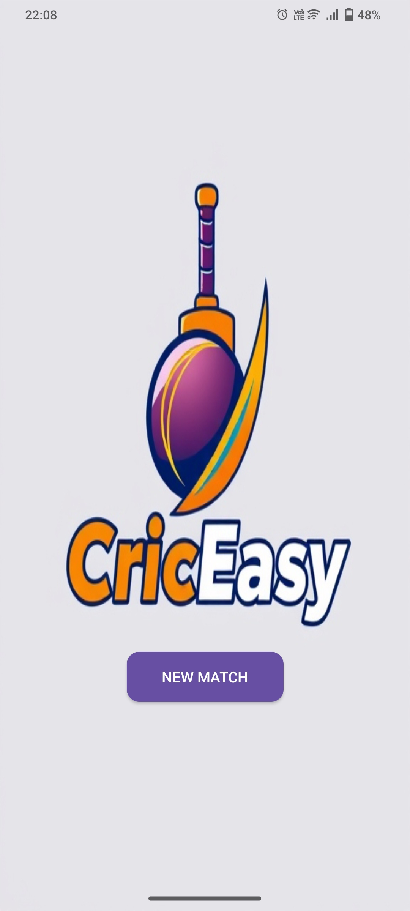
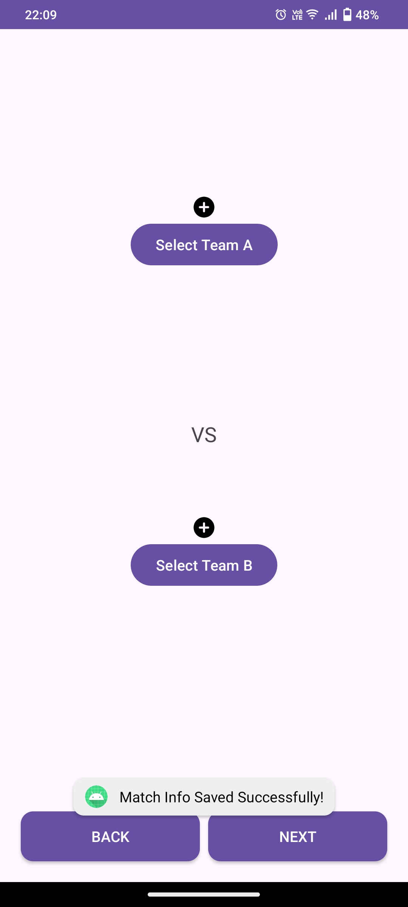
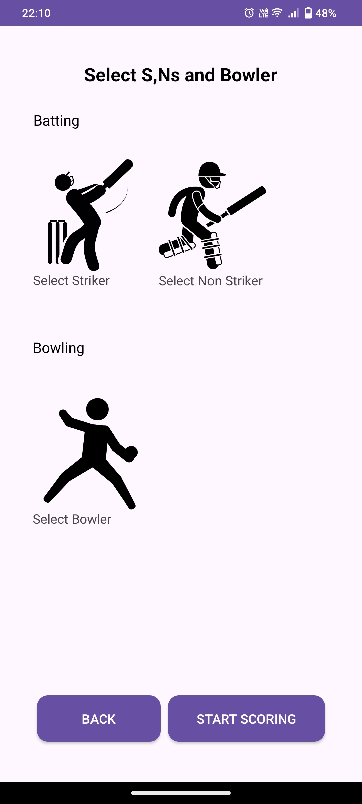
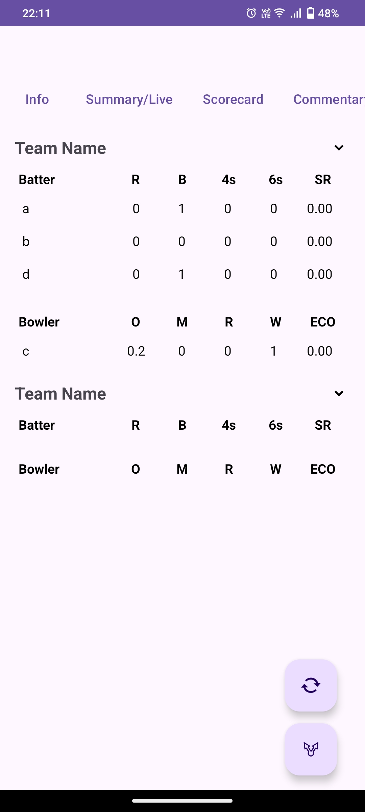
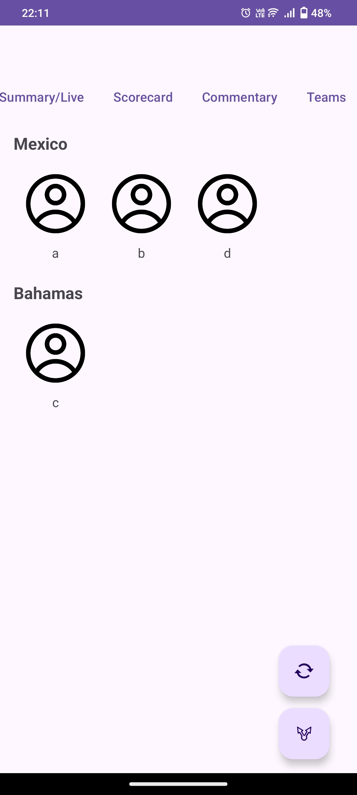

# Cricket Scoring App (Android)

## Description

This project is a fully offline, no-login-required cricket scoring application designed for Android. It simulates and tracks every aspect of a cricket match, adhering to the official MCC rules, providing users with an immersive and seamless experience. The app features a robust design that enables the efficient tracking of runs, wickets, overs, and partnerships while supporting multiple innings.

 ## Key Features:
- **Offline Scoring**: No internet connection is required to track and simulate the match.
- **Match Progress Syncing**: Uses File Sharing URIs to seamlessly synchronize match progress across multiple devices, allowing users to pick up right where they left off.
- **Modular Architecture**: Built in Java using Android Studio, the app focuses on scalability, maintainability, and long-term performance.
- **SQLite Database Integration**: Stores match data, player stats, and user preferences offline for quick access and minimal resource usage.
- **User Experience**: Features an intuitive, visually appealing UI built with XML, designed for real-time score updates during matches.
   
## Usage

1. **Start a New Match**  
   Begin by setting up the match details, such as the match format, total overs, and team names.  
   This page allows you to either **continue from where you left off** if the match was previously unfinished, or **start a new match** entirely.  
<p float="left">
  
  
  
</p>


2. **Select Teams**  
   Choose the teams participating in the match.  
   This page enables you to select teams easily and proceed with match setup.  

3. **Selecting Players**  
   This page takes player inputs and adds them to the squads.  
   You don't need to add all the players at the start, offering the flexibility to modify squads dynamically.  

4. **Live Scorecard**  
   View real-time updates of the match, including runs, wickets, partnerships, and ball-by-ball breakdowns.  
   This screen provides a detailed and interactive scorecard for seamless tracking of match progress.
   
6. **Squads**  
   Access the full squad details, including player names and their roles.  
   This page gives a quick overview of the team composition for reference during the match.  
<p float="left">
  
  
</p>


## Technologies Used
-  Android Studio
-  Java
-  XML
-  SQLite

## Future Enhancements

- Enable cloud-based data storage to allow seamless synchronization of match progress and stats across multiple devices. This will ensure users can access and continue their match from any device without interruptions.
- Support for multiple match formats (e.g., Test, ODI, T20).
- Implementing a graphical user interface (GUI).
- Integration with real-time match data.

## Contribution

We welcome contributions to improve the Cricket Scoring App! If you'd like to contribute, please follow the steps below:

### How to Contribute

1. **Fork the Repository**  
   Click the "Fork" button on the top right of this repository to create your own copy.

2. **Clone Your Fork**  
   Clone the repository to your local machine:
   ```bash
   git clone https://github.com/Yashhwanth/CricEasy.git
## Acknowledgements

I'd like to extend our sincere thanks to the following for their contributions to this project:

- **Open Source Libraries**: Special thanks to all open-source libraries and resources that have helped in speeding up the development process.
  - [Android SDK](https://developer.android.com/studio) for providing the necessary tools for Android development.
  - [SQLite](https://www.sqlite.org/) for the lightweight database support.
  - [Icon Packs](https://www.flaticon.com/) for providing icons used in the app.
  
- **Contributors**: A big thank you to everyone who has contributed code, reported issues, and suggested improvements to the app.

- **Supporters**: Thanks to the developers and communities who share their knowledge, tips, and tutorials online. Your support has been invaluable in overcoming challenges.

---

If you'd like to add anything else, feel free to reach out or open an issue. Thank you for being part of this project!


